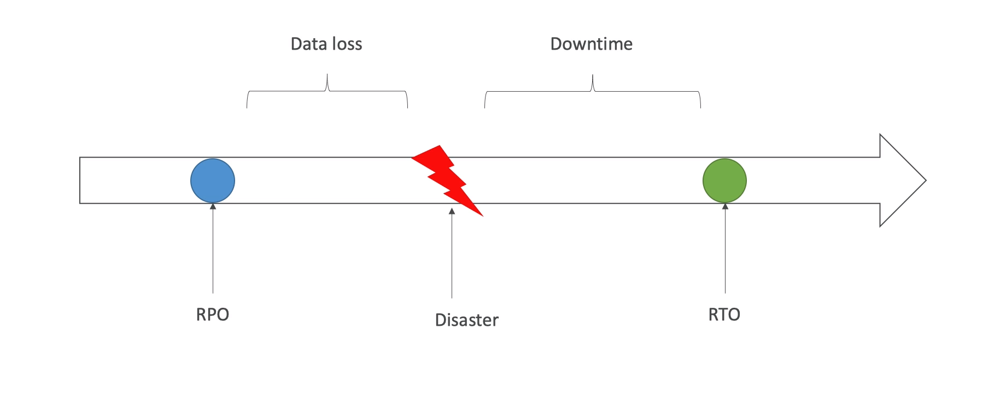

# Disaster Recovery

- RPO - Recovery Point Objective
- RTO - Recovery Time Objective

- strategies
    - Backup and restore
        - onpremise data is backed up to aws peridically
        - so on disaster the data and applications can replicated from the backups
    - Pilot Light
        - smaller version of app is always running in the cloud 
        - so on disaster of on premise switch to cloud
        - useful for the critical core ( pilot light )
        - faster than backup and restore as the critical systems are already up
    - Warm Standby
        - full system is up and running in cloud, but at minumum size 
        - upon disaster,we can scale to producetion load
    - Hot Site / Multi Site Approach 
        - full production scale is running in AWS and On Premise
        - so fast fail over

# Database Migration Services
- quiclky and securely migrate database to AWS, resilient, self healing
- the source databse remains available during the migration
- supports
    - homogenious migrations: eg: oracle to oracle
    - hetrogenious migrations: eg Microsoft SQL Server to Aurora
- Continuous Data Replication using CDC
- must create an EC2 instance to perform the replication tasks

## AWS Schema Convertion Tool (SCT)
- Convert your database's schema from one engine to another

# On-Premise Strategy
- Ablity too download Amazon Linux 2 AMI as a VM
- VM Import / Export
- AWS Application Discovery Service
    - gather information about your on-premise servers to plan a migration
    - server utilization and dependency mapping
- AWS Database Migration Service
- AWS Server Migration Service
    - Incremental replication of on-premise live servers to AWS

# DataSync
- move large amount of data from on-premise to AWS
- can synchronize to s3, efs, fsx
- move data from your NAS or filesystem via NFS or SMB
- Replication task can be scheduled hourly,daily, weekly
- can setup a bandwidth limit
- need aws datasync agent installed 

# AWS Backup
- Fully managed Service
- Centrally manage and automate backups across AWS services
- No need to create custom scripts and manual processes
- supported services
    - fsx
    - efs
    - dynamo db
    - ec2
    - ebs
    - rds
    - aurora
    - storage gateway
- supports cross region backups
- supports cross account backups
- need to create backup policies know as **Backup Plans**
    - Backup Frequency
    - Backup Window
    - Transition to Cold Storage
    - Retention Period

