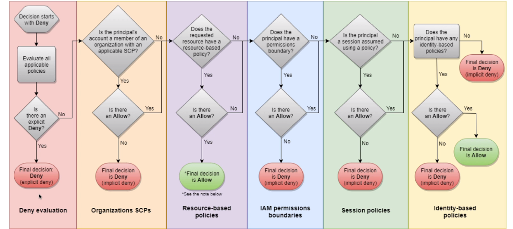

# IAM
Identiy And Access Management

Contains
 1. Root User - should not be shared ( create by default when account is created)
 2. Users - are people within organization, can be grouped
 3. Groups - can contains only users not other groups

User can be present in multiple groupes or not in a group at all.

**Users and Groups can be assigned JSON documents called policies**

Policies define permissions

**when creating policies go for least required permissions**

> IAM is a global service does not require a region


## Sample Policy

```JSON
{
    "Version": "2012-10-17",
    "Statement": [
        {
            "Sid": "AllowUsersToPerformUserActions",
            "Effect": "Allow",
            "Action": [
                "iam:ListPolicies",
                "iam:GetPolicy",
                "iam:UpdateUser"
            ],
            "Resource": "*"
        }
    ]
}
```


## Protection Users

### Password Policy

Can set up custom password policy based on 
1. Minimun password length
2. Required character types
3. Prompting users to change passwords
4. specifing password expiration time
5. Preventing password re-use

### Multi Factor Authentication - MFA

MFA is a compination of password and a security device

Can be done using Virual MFA devices or Universal 2nd Factor (U2F) security Key

Some of the virtual MFA devices are
1. Google Authenticator ( currently only in phone )
2. Authy ( multi device )

U2F key - YubiKey - 3rd Party


### Configuring CLI 

1. Generate Access Key and Secret Key
2. Install CLI
3. Configure with command ```aws configure```


## IAM Roles

Permissions for services to access another services in aws

eg:
1. EC2 instance roles
2. Lambda Function roles


## IAM Security Tools

shows status of verious things in IAM

1. ### Iam Credetinal Report (Account - level )
    - A report that list all your account's users and the status of theire various credentials
2. ### IAM Access Advisor ( user -level )
    - shows the service permissions granded to a user ans when those services were last accessed

## IAM Coniditions
- iam policies based on conditions
- example 

    ```json
    {
        "Version":"<<VERSION>>",
        "Statement":{
            "Effect":"Deny",
            "Action":"*",
            "Resource":"*",
            "Condition":{
                "NotIpAddress":{
                    "aws:SourceIp":[
                        "192.0.2.0/24",
                        "203.0.1112.0.24"
                    ]
                }
            }
        }

    }
    // restrict the client ip from which api calls are being made
    

## IAM Permission Boundaries
- These we can define boundaries on which iam roles can be provided
- premission boundaries are supported for users and roles
- exmple
    - iam permission boundary
        ```json
            {
                "Version":"<<VERSION>>",
                "Statement":{
                    "Effect":"Deny",
                    "Action":[
                        "s3:*",
                        "cloudwatch:*",
                        "ec2:*"
                    ],
                    "Resource":"*",
                }

            }
        ```
    - IAM policy
        ```json
            {
                "Version":"<<VERSION>>",
                "Statement":{
                    "Effect":"Deny",
                    "Action":"iam:CreateUser",
                    "Resource":"*",
                }

            }
    - which results in no permission since it is outisde boundary

## IAM Policy Evaluation Logic



