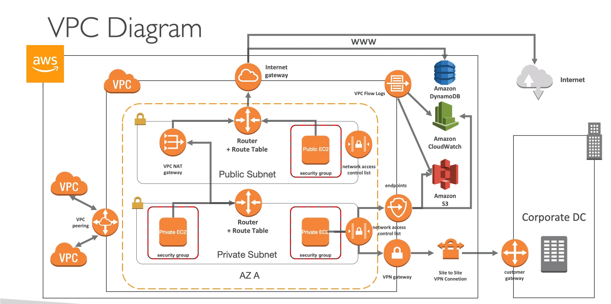
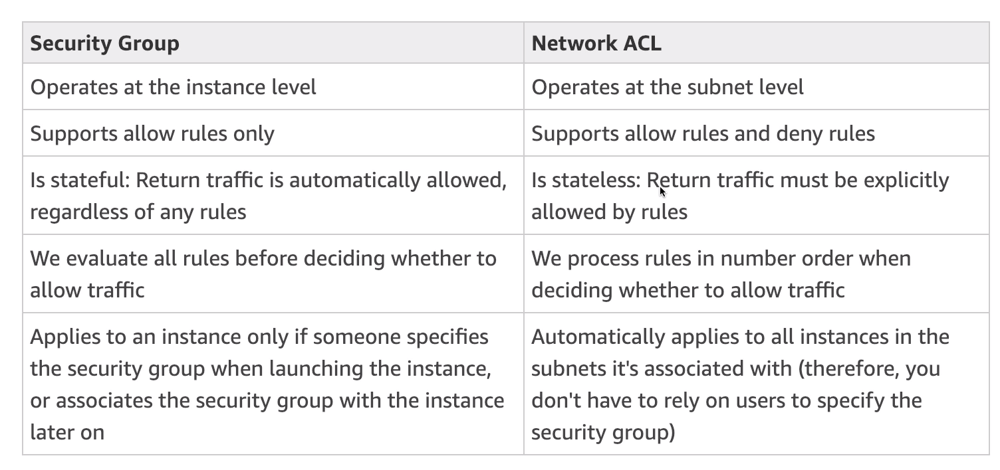
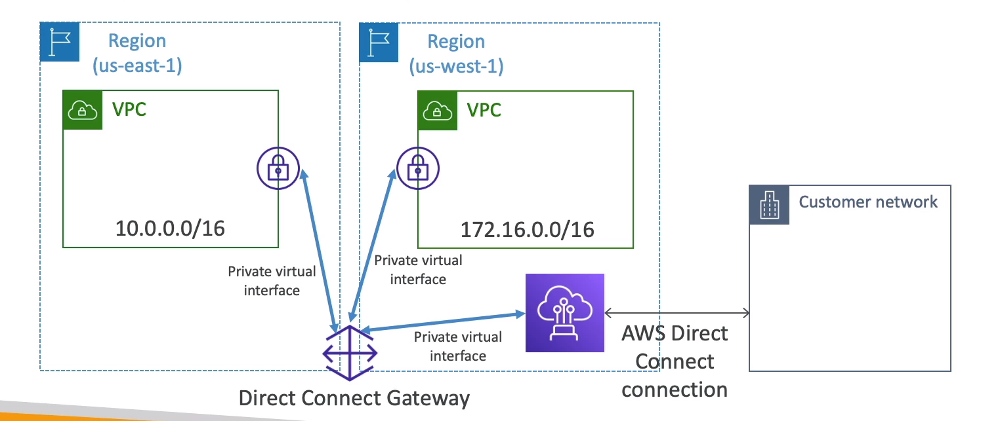
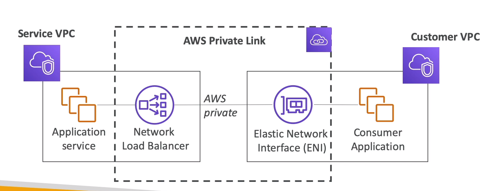
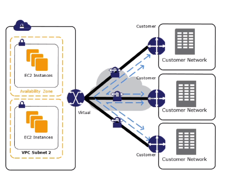
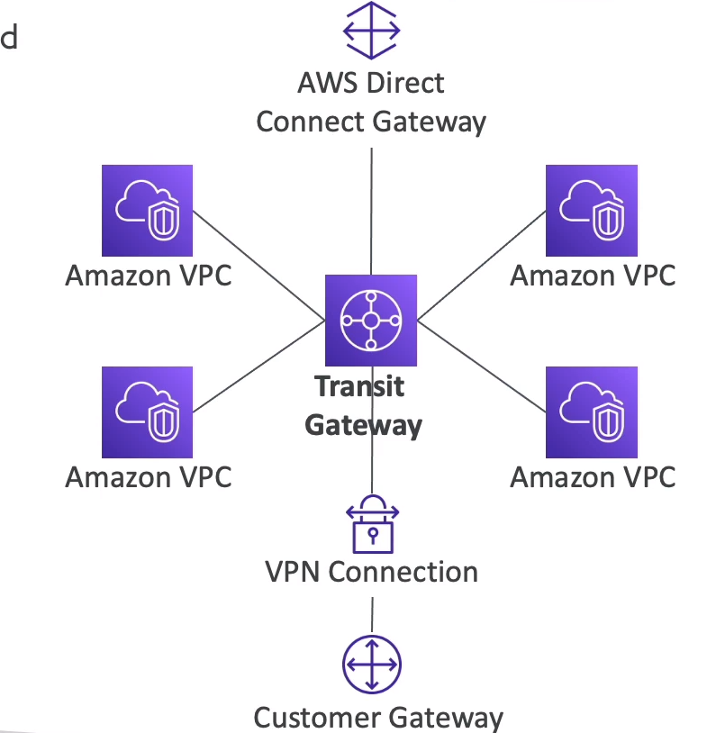

# CIDR - Classless Inter-Domain Routing
- CIDR are used in security group rules or AWS networking in general
- used to define a set of IP address range
    - eg: 192.168.0.0/26 -> 192.168.0.0 - 192.168.0.63 ( 64 IP )
    - contains base ip
    - subnet mask 
        - how many bits can be changed in the IP
            - /32 -> 1 IP -> 2^0 -> 32 - 32= 0
            - /31 -> 2 IP -> 2^1 -> 32 - 31= 1
            - /30 -> 4 IP -> 2^2 -> 32 - 30= 2
            - /29 -> 6 IP -> 2^3 -> 32 - 29= 3
            - /28 -> 16 IP -> 2^4 -> 32 - 28= 4
            - /27 -> 32 IP -> 2^5 -> 32 - 27= 5
        - 32 - subnet max gives the power or 2

# Private vs Public IP
- The Internet assigned Number Authority ( IANA ) established certail blocks of IVP4 addresses for the use of private ( LAN ) and public addresses
- Private IP can only allow certain values
    - 10.0.0.0 -> 10.255.255.255 ( 10.0.0.0/8) - big networks
    - 172.16.0.0 -> 173.31.255.255 ( 172.16.0.0/12 ) - default AWS
    - 192.268.0.0 - 192.168.255.255 ( 192.168.0.0/16) -  home networks 
- All the rest are public ips

        

# Default VPC
- all new accounts have a default VPC
- New instances are launched into default VPC if not subnet is specified
- default VPC have internet connectivity and all instances have public ip
- we also get a public and a private DNS name

# VPC in AWS
- can have mulitple VPCx in a region ( max 5 per region - soft limit )
- max CIDR per VPC is 5 
    - CIDR min size -> /28 -> 16 IPs
    - CIDR max size -> /16 -> 65535 IPs
- CIDR should not overlap with your other networks

## Subnets
- then can be mutiple subnets inside VPC
- subnets are tagged to availablity zones
- **AWS reserves 5 IPs address( first 5 and last 1 IP ) in each subnet**
    - these cannot be used or assigned to a instance
    - aws uses it for
        1. Network address
        2. Reserved for AWS VPC router
        3. Reserved for mapping to Amazon-provied DNS
        4. Reserved for future use
        5. Network broadcast address. **AWS does not support broadcast in VPC, therefore the address is reserved**

## Internet Gateways
- Internet gateways helps our VPC instances connect with the internet
- it scales horizontally and is HA and redundant
- Must be created separately from VPC
- One VPC can only be attached to one IGW and vice versa
- Internet Gateway is also a NAT for the instances that have a public IPv4
- **Internet Gateways on their own do not allow internet access**   
    - Route table has to be edited to have internet access

> if we add **private subnets to the routes in internet gate** way it will have intener access but **these instances will be available publicly**

## NAT instances
- Alows instances in the private subnets to connect to the internet
- Must be launched in a public subnet
- **Must disale EC2 flag: source/destination check**
- **Must have an Elastic IP attached to it**
- Route table must be configured to route traffic from private subnets to NAT instances
- security groups of the NAT instances should allow all HTTP and HTTPS traffic comming from the private subnet 
- no higly available
- internet traffic bandwidth depends on ec2 intance performance
- must manage security groups

## Network Gateways
- AWS managed NAT, Higher bandwidht, better availablity , no admin
- Pay per hour for usage and bandwidth
- Nat is created in specific AZ, uses a EIP
- Cannot be used by an instance in that subnet
- Requires Internet GateWay (IGW) ( Private Subnet -> NAT -> IGW )
- 5 Gbps of bandwidth with automatic scalling up to 45 Gbps
- no security group to manage/required
- if high availablity is needed, set up NAT gateways in multiple AZs

## DNS Resolution in VPC
- enableDnsSupport ( = DNS Resolution setting )
    - defalut true
    - helps decide if DNS resolution is supported for the VPC
    - if true, queries the AWS DNS server at 169.254.169.253
- enableDnsHostname ( = DNS Hostname setting)
    - false by default for newly created VPC, True by default for Default VPC
    - wont do anything unless enableDnsSupport is true
    - if true, assign public hostname to ec2 instance if it has a public 
- if you use custom DNS domain names in private zone in Route 53, you must set both these attributes to true
- private zones can be created in route53
    - so instances will have a host name assigned to it so that intances can be access using these hostname instead of the ips from the private network

## Network ACLs And security Group
- security groups inside subnets
    - these are statefull
        - if inbound rule is allowed, outbound is also allowed
- Network access control list sits outside the subnet
    - control the traffic before reaching the security groups
    - these are stateless
        - inbound rules and outbound rules will be evaluated
    - NACL is like firewall which control traffic from and to subnet
    - default NACL allows everyting outbound and everything inbound
    - **One NACL per Subnet** - new subnets are assigned the default NACL
    - **Rules have a number** ( 1 - 32766 ) and **higher precedence with a lower number**
        - eg: 100 allow [[IP]] and 200 deny [[IP]] -> ip will be allowed
    - NACL are great way of blocking a specific IP at the subnet level
    - **Ephemeral Ports**
        - 32768 - 65535
        - client that request chooses the ephemeral port range
            - many linux kerneluse ports 32768 - 61000
            - elastic load balencer request uses - 1024 - 65535

# VPC Peering
- allows to connect 2 VPC, privately using AWS network
- make them behave as if they were in the same network
- must not have overlapping CIDR
- **not transitive** ( must be established for each VPC that need to communicate with one another )
- must update route tables in each VPC subnet to ensure instances can communincate
- vpc peering can work **inter-region**, **cross-account**
- can reference a security group of a peered VPC ( works cross account )

# VPC Endpoints 
- alows instances to access aws services using private network ( rather than pubic internet )
- removes the need of IGW, NAT.. to access AWS services
- **Inteface** 
    - provisions an ENI ( private IP address ) as an entry point ( must attach security group )- most AWS services
- **Gateway**
    - provisions a target arn must be used in a route table - s3 and DynamoDB

# FLow Logs
- Caputure information about IP traffic going into your interfaces
    - VPC FLow logs
    - Subnet Flow Logs
    - Elastic Network Inteface Flow logs
- helps to monitor & troubleshoot connectivity issues
- can go to s3 / cloudwatch logs

# Bastion Hosts
- we can use Bastion host to ssh into private instances
- **jump servers**
- The bastion is in hte public subnet which is then connected to all other private subets
- Bastion host security group must be tightened

# VPN Gateway
- used to connect coroprate data center to vpc
- customer side need something called customer gateway
    - customer gateway can be 
        - software application
        - physical device
- IP Address
    - use static, internet routable IPaddress for your customer gateway device
    - if behind CGW behind NAT, use the public IP address of the NAT

# Direct Connect
- provides a decicated private connection from a remote network to your VPC
- dedicated connection must be set up between your datacenter and aws direct connect locations
- need to setup a Virtual Private Gateway on your VPC
- access public resource s3 and private ec2 on the same connection
- Usecases
    - increase bandwidth throughput - working large datasets
    - more consistant network expreriance - applications using real-time data feeds
    - hibrid enviroments ( corporate dc and aws )
- physical ethernet port dedicated to a customer
- request made to AWS first, then completed by AWS Direct Connect Partners
- takes atleast 1 month to establish
- data is not encrypted by default
    - if needed encryption set up VPN ( provides IPsec encrypted private connection )
- maximum resilience is achieved by separate connections terminating on separate devices in more than one location

## Direct Connect Gateway
- if you want to setup a direct connect to one or more VPC in many regions ( same account )

# Egress only Internet gateway
- Egress only Internet gateway is for IPv6 only
- Similar function as **NAT, but for IPv6**
- Ipv6 are all public addresses
- Egress only Internet Gateway gives our IPv5 instancess access to the internet, but they wont be directly reachable by the internet
- has to edit route tables

# Private Link ( VPC Endpoint Services )
- exposing services in one VPC to other VPC
- requires network load balencer ( service VPC ) and ENI ( customer VPC )

# Classic Link ( depricated )
- instances run in a single network shared with other customers
- VPC - your instances run logically isolated to your aws account
- classic link allows you to link EC2- Classic instances to a VPC in your account
    - must associate a security group
    - enable communication using private IPv4 addresses
    - removes the need to make use of publlic IPv4 addresses or Elastic Ip addresses

# VPN CloudHub
- provides secure communication between locations (s ites ), if you have multiple vpn connetions

# Transit Gateway
- for having transitive peering between thousands of VPC and on-premises, hugb-and-spoke (star) connection 
- route tables:limit which vpc can talk with other VPC
- works with Direct Connect Gateways, VPN Connections
- supports IP Multicast ( not supported by any other AWS service ) 

